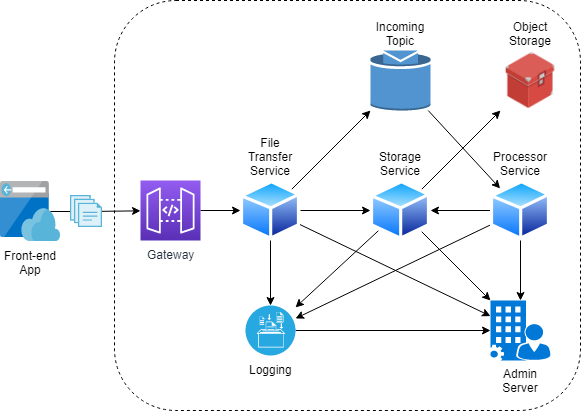

# file-transfer-system
File Transfer System is a distributed solution for transfering and processing files efficiently.

# [File Transfer System](https://github.com/jonatascbarroso/file-transfer-system/)

File Transfer System is a distributed solution for transferring and processing files efficiently.

Briefly, the system receives a file, saves in object storage and notifies a messaging topic to be processed.
After upload, the file is read, processed, and stored to stay available for download.
In the end, users use a service to get this processed file.

## Architecture



### Components

* **Frontend App**: a graphical interface used by users to send and receive the files.
* **Gateway**: a component to manage and protect the public API of the backend.
* **File Transfer Service**: 
* **Storage Service**: 
* **Processor Service**: 
* **Object Storage**: 
* **Incoming Topic**: 
* **Admin Server**: 
* **Logging**: 

### Technologies

* Front-end: [React](https://reactjs.org/)
* Microservices: [Spring Boot](https://spring.io/projects/spring-boot)
* Messaging: [Apache Kafka](https://kafka.apache.org/)
* Object Storage: [MinIO](https://min.io/)

### Prerequisites

* Maven 3
* Java 8

## Running

### Admin Server and Service Discovery
```
cd admin
mvn clean package spring-boot:run
```
